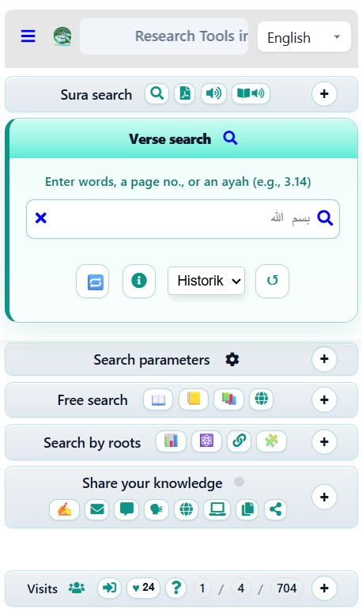

<div align="center">

# Alfamous

**Plateforme de recherche sémantique du Coran**

[](./LICENSE)
[](https://developer.mozilla.org/fr/docs/Web/JavaScript)
[](https://firebase.google.com/)

*Étudier, explorer et préserver le texte coranique par la racine, le mot et le sens.*

**🌍 Langue :** Français · [English](./README.en.md)

</div>

---

## ✨ Présentation

**Alfamous** (interface « Zoom-Coran ») est une plateforme open source de **recherche sémantique et lexicale du Coran**. Elle permet d'explorer le texte par **racines arabes**, par **mots** et par **synonymes**, et de croiser ces données avec un lexique de référence (*Maqāyīs al-Lugha* d'Ibn Fāris) et des traductions multilingues.

Mais Alfamous est bien plus qu'un moteur de recherche : c'est un **atelier collectif** pour *travailler* le Livre — pas seulement le consulter.

> 🌐 Démo en ligne : `https://alfamous-amha.web.app` · 📖 [Manifeste complet (page « À propos »)](https://alfamous-amha.web.app/APropos.html)



## 🧭 Notre approche

- **Ouvert à tous.** Le Coran n'est pas réservé à des élites religieuses : aucun diplôme n'est requis pour lire, chercher, commenter, proposer un sens, ouvrir un fil ou publier une note. Ce qui compte, c'est **le texte** — pas le titre, ni l'autorité, ni l'appartenance.
- **Le texte d'abord.** Par choix méthodologique, la lecture part **exclusivement du texte coranique**. Les hadiths n'entrent pas dans le dispositif d'analyse (ni comme preuve, ni comme autorité, ni comme grille imposée) : une frontière nette est maintenue entre *ce que dit le texte*, *ce que l'on mesure* et *ce que l'on propose*.
- **Une base vivante.** Ce n'est pas une encyclopédie figée : chacun peut enrichir le corpus (commentaires sur les versets, thèmes du lexique). « Pas une chapelle. Un chantier. »
- **Une recherche qui relie.** Un seul mot traverse d'un mouvement le Coran, le lexique, le forum, les témoignages, les articles et les médias.

## 🌟 Ce qui rend Alfamous unique

À notre connaissance, Alfamous est **la seule application** qui réunit, dans un même espace de recherche coranique :

- 💬 **L'annotation collaborative** : ajouter des **commentaires** directement **aux versets** et à des **expressions**, dans la **langue de son choix** — une fonctionnalité inédite dans la recherche coranique.
- 🔗 **Le croisement racine ↔ mot ↔ sens**, appuyé sur le lexique étymologique d'Ibn Fāris et des statistiques de racines.
- 🌍 **Une approche réellement multilingue** (arabe, français, anglais, espagnol, kabyle), pensée pour l'étude comparée — avec écoute audio des versets et sourates.

## 🎯 Notre vision

Alfamous a été conçu comme un **bien commun** au service de l'étude du texte coranique. En l'ouvrant sous licence GPL v3, l'objectif est de **le confier à une communauté** de passionné·e·s et de professionnel·le·s talentueux qui pourront :

- **étudier** le fonctionnement de l'outil en toute transparence ;
- **l'améliorer** et l'enrichir de nouvelles fonctionnalités ;
- **vérifier** la rigueur des données et des traitements ;
- **le préserver et le diffuser largement**, au-delà de son auteur initial.

> Toute contribution — technique, rédactionnelle ou spirituelle — est chaleureusement bienvenue (voir [CONTRIBUTING.md](./CONTRIBUTING.md)).

## 🔑 Fonctionnalités principales

L'interface est organisée en **panneaux**, repris ici fidèlement. *(Interface multilingue : FR, EN, AR, ES, KAB ; menu contextuel sur la sélection.)*

### 🔎 Recherche Soura
Choisir une **sourate (1–114)**, puis : 📄 **Warsh** (PDF), 🔊 **Écoute** (audio), 📖 **Lis** (lecture du texte).

### 🔎 Recherche de versets
Saisir des **mots** (arabe ou latin), un **n° de page** ou une **aya** (ex. `3.14`). Navigation verset par verset (1 / 1844), bascule **ME** (mot entier) / **MC**, historique des recherches.

### 🧰 Outils

| | Fonction |
|---|---|
| 🔁 | **Translittération** — arabe ↔ caractères latins dans le champ de recherche |
| ℹ️ | **Aide** — informations et tableau sur la translittération |
| ↺ | **Réinitialiser** — supprimer l’historik personnalisé (lexique conservé) |
| ☁️⬆️ | **Export Historik** — vers Firebase Storage |
| ☁️⬇️ | **Import Historik** — depuis Firebase Storage |
| 📋 | **Copier sélection** — versets sélectionnés dans le presse-papiers |
| 🌙 | **Thème** — bascule clair / sombre |

### ⚙️ Paramètres
Mot entier (**ME**), ordre des mots (**MC**), choix du **livre de tafsir**.

### 📚 Cherche — *module SAWM*

| | Fonction |
|---|---|
| 📖🍃 | Recherche auto et fenêtre **Zoom 0-1-2-3** (Coran + commentaires), selon le contexte |
| 📖 | Recherche auto et fenêtre **Zoom 0-2-3** (Zoom-Coran), selon le contexte |
| 📒 | Recherche auto et fenêtre **Zoom 0-3** (Lexique), selon le contexte |
| 📕 | **Lexique Ibn Fāris** selon OpenITI |

### 🌿 Racines — *module SALAT*

| | Fonction |
|---|---|
| 📊 | **Statistique** des racines coraniques |
| 🌿 | **Racines d’un verset** (ex. `3.14`) |
| ⚛️ | **Synonymie** — atomes (sons) et racines combinées dans une expression |
| 🔗 | **Amis de la racine** — mots dans le verset (d=1, si contigu) |
| 🧩 | **Déclinaisons** des mots d’une racine |

*Inspiré des travaux du Dr Sameer Islambulli.*

### 📤 Partage — *module CHOKR*

| | Fonction |
|---|---|
| 📝 | **Mes Notes** privées ou publiques (Forum) — synthèse et reconnaissance vocale (TTS / STT) |
| ✍️ | **Mes commentaires** (Lexique / Coran) |
| 💬 | **Forum des idées** 💡 — publications privées et publiques |
| 📚 | **Articles publiés sur Alfamous** |
| 🌐 | **Articles publiés sur Blogger** ([blog.alfamous.ca](https://blog.alfamous.ca)) |
| 🗣 | **Témoignages anonymes** (modération) |
| 💻 | **Bibliothèque numérique** |

### 🔐 Admin *(réservé, niveau ≥ 3)*
Outils d'administration : **médias**, **traductions**, **newsletter** (@) avec désabonnement, gestion des **utilisateurs**, **lexique**.

### 👥 Visiteurs
Statistiques de **présence en temps réel** (connectés · onglets actifs · cumul), **connexion / déconnexion** · ✉️ **Messagerie / contact** · 🔗 **Partage de lien** · ❤️ « **J'aime** ».

## 🌐 Écosystème

Le projet s'appuie sur **deux piliers complémentaires** :

- **[Alfamous.ca](https://www.alfamous.ca)** — l'outil d'analyse dans le texte (cette application).
- **[blog.alfamous.ca](https://blog.alfamous.ca)** — l'espace de publication et de mise en perspective (articles, analyses, études de cas).

## 👥 Pour qui ?

Pour **toute personne** qui veut lire le Coran et contribuer — curieux·ses, étudiant·e·s, chercheur·e·s — **sans prérequis d'expertise institutionnelle**. Les mêmes outils servent la même exigence de méthode : texte, données, analyses.

## 🧱 Pile technique

| Couche | Technologies |
|---|---|
| **Frontend** | HTML, CSS (modulaire), JavaScript « vanilla », Firebase SDK (compat) |
| **Backend** | Firebase Cloud Functions (Node.js 20), Express |
| **Base de données** | Cloud Firestore |
| **Authentification** | Firebase Auth |
| **Stockage** | Firebase Storage |
| **Hébergement** | Firebase Hosting |
| **Services** | Google Text-to-Speech / Speech, Nodemailer (SMTP), Google Sheets / Apps Script |

## 📁 Structure du dépôt

```text
Alfamous/
├── public/              # Application web (frontend déployé sur Firebase Hosting)
│   ├── jsZC/            # Modules JavaScript (recherche, forum, lexique, médias…)
│   ├── styles/          # Feuilles de style modulaires
│   └── *.html           # Pages (index, contact, à propos…)
├── functions/           # Cloud Functions Firebase (backend Node.js)
├── Gscript/             # Scripts Google Apps Script (.gs)
├── firebase.json        # Configuration Hosting / Functions / Firestore / Storage
├── firestore.rules      # Règles de sécurité Firestore
├── storage.rules        # Règles de sécurité Storage
├── firestore.indexes.json
└── package.json
```

## 🚀 Installation locale

### Prérequis

- [Node.js](https://nodejs.org/) **20+**
- [Firebase CLI](https://firebase.google.com/docs/cli) : `npm install -g firebase-tools`
- Un projet Firebase (pour le déploiement)

### Étapes

```bash
# 1. Cloner le dépôt
git clone https://github.com/<votre-utilisateur>/alfamous.git
cd alfamous

# 2. Installer les dépendances du backend
cd functions
npm install
cd ..

# 3. Configurer les secrets (voir la section Configuration)
cp .env.example .env
cp functions/quick-login.example.json functions/quick-login.json

# 4. Lancer en local (émulateurs Firebase)
firebase emulators:start
```

> Le frontend (`public/`) peut aussi être servi par n'importe quel serveur de fichiers statiques pour le développement.

## ⚙️ Configuration & secrets

Alfamous nécessite plusieurs identifiants qui **ne sont jamais inclus dans le dépôt** (voir `.gitignore`) :

| Élément | Où l'obtenir | Fichier local (ignoré) |
|---|---|---|
| Clé de compte de service Google Cloud | Console Google Cloud → Comptes de service | `key.json` / `functions/*-adminsdk-*.json` |
| Secret client OAuth | Console Google Cloud → Identifiants | `functions/client_secret*.json` |
| Identifiants SMTP & app | `firebase functions:config:set` | (config Firebase) |
| Connexion rapide (dev) | Vous-même | `functions/quick-login.json` |

Des **modèles** sont fournis : `*.example.json` et `.env.example`. Copiez-les et remplissez-les **sans jamais committer les versions réelles**.

> 🔒 La clé `apiKey` Firebase présente dans `firebaseConfig.js` est une **clé Web publique par nature** (protégée par les règles Firestore et la restriction de domaine), ce n'est pas un secret.

## ☁️ Déploiement

```bash
# Déployer tout (hosting + functions + règles)
firebase deploy

# Ou cibler une partie
firebase deploy --only hosting
firebase deploy --only functions
firebase deploy --only firestore:rules
```

## 📜 Licence

Ce projet est distribué sous licence **GNU General Public License v3.0**. Voir le fichier [LICENSE](./LICENSE).

### Licence des données et contenus

⚠️ Le **code** est sous GPL v3, mais les **contenus** (texte coranique, traductions, lexiques, médias, polices) peuvent relever de droits ou licences distincts. Merci de vérifier la provenance et les conditions d'utilisation de chaque jeu de données avant toute réutilisation.

## 📚 Documentation

Une documentation technique détaillée est disponible dans le dossier [`docs/`](./docs/) :

- [**Architecture**](./docs/ARCHITECTURE.md) — vue d'ensemble technique (frontend, backend, services).
- [**Modèle de données**](./docs/DATA-MODEL.md) — collections Firestore et leur rôle.
- [**Déploiement**](./docs/DEPLOYMENT.md) — mise en ligne sur Firebase, pas à pas.
- [**Configuration**](./docs/CONFIGURATION.md) — secrets, clés API, variables d'environnement.
- [**Migration**](./docs/MIGRATION.md) — réinstaller le projet sur un nouvel ordinateur.
- [**Feuille de route**](./docs/ROADMAP.md) — pistes d'évolution et idées de contribution.

## 🤝 Contribuer

Les contributions sont les bienvenues ! Consultez [CONTRIBUTING.md](./CONTRIBUTING.md) pour les conventions et le processus, et [CODE_OF_CONDUCT.md](./CODE_OF_CONDUCT.md) pour le cadre de bienveillance.

## 📝 Journal des modifications

Voir [CHANGELOG.md](./CHANGELOG.md).

## 👤 Auteur

**Amha NathAli** — gmpcdz@gmail.com

Ingénieur civil et titulaire d'un Master en gestion de projet, programmeur autodidacte depuis 1993. Sa recherche outillée du texte coranique, initiée en 2009, a donné naissance à **Alfamous** (l'application) et à **blog.alfamous.ca** (le blog).

---

<div align="center">
<sub>« Rendre le projet étudiable, vérifiable et préservable par la communauté. »</sub>
</div>
