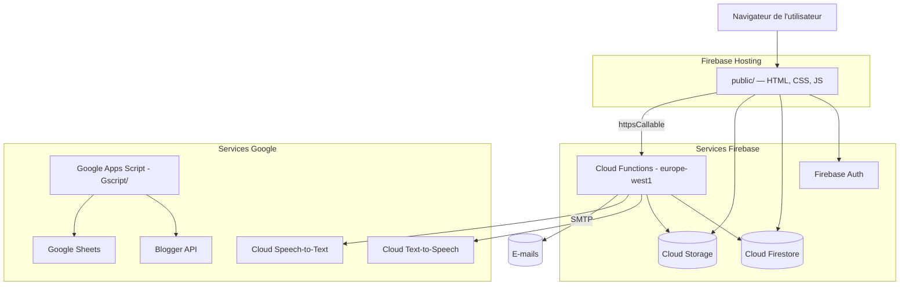

# Architecture d'Alfamous

Ce document décrit l'organisation technique d'Alfamous pour aider tout nouveau contributeur à se repérer rapidement.

## Vue d'ensemble

Alfamous est une application web **statique côté client** (HTML/CSS/JS « vanilla ») adossée à des services **Firebase** et à quelques **Google Apps Script** pour des tâches annexes.

## Les grandes couches

### 1. Frontend — `public/`

Application servie par **Firebase Hosting**. Pas de framework : du JavaScript modulaire chargé par les pages HTML.

- `public/index.html` — page principale (interface « Zoom-Coran »).
- `public/jsZC/` — ~45 modules JavaScript, chacun responsable d'un domaine :
  - **Recherche & Coran** : `Zoom-Coran.js`, `mots-coran.js`, `statRacines.js`, `fTabVersets1.js`, `fTabLexique1.js`, `synonymes.js`, `FR-AR.js`.
  - **Lexique Ibn Fāris** : `Lexique.js`, `ibn-fares-openiti-popup.js`, `ibn_fares_openiti_roots.js`.
  - **Annotation / commentaires** : `comment.js`, `com12.js`, `enregistrer.js`, `histMots.js`.
  - **Forum** : `forum.js`, `forum-notify-inbox.js`, `articles-forum-modal.js`.
  - **Témoignages** : `temoignages-module.js`, `temoignages-charte-fragment.js`.
  - **Médias & notes** : `medias1.js`, `mes-notes-tts.js`, `transcription.js`.
  - **Auth & sessions** : `connexion.js`, `sessions.js`, `firebase-local-init.js`, `safeInit.js`.
  - **Newsletter / contact** : `newsletter.js`, `contact.js`.
  - **UI / utilitaires** : `theme-toggle.js`, `zc-*.js`, `selection-context-lite.js`, etc.
- `public/styles/` — CSS découpé par responsabilités (`01-tokens.css` → `99-overrides.css`).

### 2. Backend — `functions/` (Cloud Functions, Node.js 20)

Toutes les fonctions sont déployées en région **`europe-west1`**. Voir [DATA-MODEL.md](./DATA-MODEL.md) pour les collections associées.

| Fonction | Type | Rôle |
|---|---|---|
| `onForumAuthorNotificationEmail` | Déclencheur Firestore (`forumAuthorNotifications`) | Envoie un e-mail à l'auteur quand on répond à son fil de forum |
| `onContactMessageEmail` | Déclencheur Firestore (`messagesContact`) | Alerte e-mail à l'admin pour un nouveau message de contact |
| `sendEmailToSubscribers` | Callable (admin, niveau ≥ 3) | Envoi d'un e-mail à tous les contacts inscrits |
| `sendQueuedNewsletterCampaign` | Callable (admin) | Envoi d'une campagne newsletter mise en file |
| `newsletterUnsubscribe` | HTTP (`onRequest`) | Lien de désabonnement signé (HMAC) |
| `getQuickLoginMap` | Callable | Renvoie la table de connexion rapide (sans mots de passe) |
| `syncAuthFromDemandeCollaborerLexique` | Callable (admin) | Synchronise Firebase Auth ↔ collection des collaborateurs |
| `synthesizeMesNoteAudio` | Callable (auth) | Génère un MP3 (Text-to-Speech) d'une note → Storage |
| `transcribeMesNoteMediaUrl` | Callable (auth) | Transcrit un audio distant en texte (Speech-to-Text) |

Modules de support : `mail.js` (envoi SMTP via Nodemailer), `mesNoteTts.js` / `mesNoteStt.js` (TTS/STT), `firebaseConfig.js` (config web publique).

### 3. Sécurité des données

- **`firestore.rules`** — règles d'accès Firestore (schémas stricts, lecture publique contrôlée, écriture conditionnée à l'authentification ou à des validations de champs).
- **`storage.rules`** — règles d'accès au stockage de fichiers.
- L'autorisation « administrateur » repose sur un **niveau ≥ 3** dans la collection `demandeCollaborerLexique`, croisé avec l'e-mail Firebase Auth.

### 4. Scripts annexes — `Gscript/`

Scripts **Google Apps Script** (exécutés sur l'infrastructure Google, indépendamment de l'app) :
- Synchronisation d'articles depuis **Blogger** (`ArticlesBlogHtml.gs`).
- Génération de tableaux versets/racines, médias partagés, messages aux abonnés.

> ⚠️ Les valeurs sensibles de ces scripts (ex. clé API Blogger) vivent dans `Gscript/secrets.gs` (exclu de Git) ou dans les *Propriétés du script*. Voir [CONFIGURATION.md](./CONFIGURATION.md).

## Choix techniques notables

- **Pas de build frontend** : simplicité, lisibilité, faible barrière d'entrée pour contribuer.
- **Firestore en lecture publique** sur la plupart des collections, écriture protégée par règles — adapté à un contenu communautaire ouvert mais modéré.
- **Long polling Firestore** forcé (`firebase-local-init.js`) pour fiabiliser la connexion sur certains réseaux.
- **Cloud Functions régionales** (`europe-west1`) pour la proximité et la cohérence.
