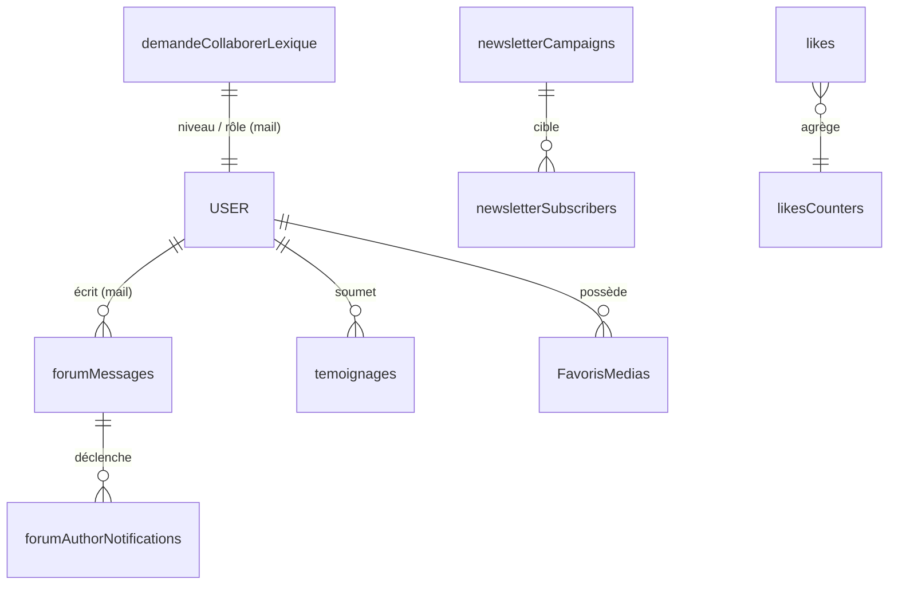

# Modèle de données (Cloud Firestore)

Ce document recense les **collections Firestore** utilisées par Alfamous, leur rôle et leurs règles d'accès principales. La source de vérité des règles reste le fichier [`firestore.rules`](../firestore.rules).

> Convention : « lecture publique » signifie `allow read: if true` ; « écriture authentifiée » signifie `allow write: if request.auth != null`.

## Collections principales

| Collection | Rôle | Lecture | Écriture |
|---|---|---|---|
| `messagesContact` | Messages du formulaire de contact (sans compte) | publique | création publique (schéma strict anti-spam) ; modif/suppr. authentifiée |
| `newsletterSubscribers` | Abonnés newsletter (docId = e-mail) | publique | création/màj publique avec validation de schéma |
| `newsletterCampaigns` | Campagnes newsletter (objet, contenu, statut) | — | gérée côté admin / Functions |
| `temoignages` | Témoignages soumis par les visiteurs | publique | création publique (`status: pending`) ; modération authentifiée |
| `forumMessages` | Fils de forum (publics ou privés) | publique sauf fils privés (auteur) | auteur du fil, ou tout compte connecté sur fils publics |
| `forumAuthorNotifications` | File de notifications de réponses (déclenche e-mail) | — | écrite par l'app, consommée par Cloud Function |
| `likes` | « J'aime » par appareil (clientId localStorage) | publique | création publique validée ; suppression libre |
| `likesCounters` | Compteurs agrégés de « J'aime » | publique | incrément/décrément validé (+1 / −1) |
| `demandeCollaborerLexique` | Profils des collaborateurs + **niveau** (rôle) | publique | authentifiée ; **niveau ≥ 3 = admin** |
| `LiensMedias` | Liens de médias partagés | publique | authentifiée |
| `FavorisMedias` | Favoris médias des utilisateurs | publique | authentifiée |

## Présence & statistiques (temps réel)

| Collection | Rôle |
|---|---|
| `rtPresenceCounter` | Compteur global de présence |
| `rtPresenceTabs` | Onglets/sessions actives |
| `daily` | Statistiques journalières |
| `counters` | Compteurs divers |
| `clients` | Clients/appareils connus |
| `historiqueActions` | Journal d'actions |

Ces collections sont en **lecture publique** et **écriture authentifiée**.

## Règle « fourre-tout »

En complément des règles spécifiques, une règle finale s'applique à tout document non couvert :

```
match /{document=**} {
  allow read: if true;                       // lecture publique
  allow write: if request.auth != null && (… exclut forumMessages …);
}
```

Le forum (`forumMessages`) est **explicitement exclu** de ce fourre-tout afin que ses règles spécifiques (fils privés, propriété par e-mail) ne soient pas court-circuitées.

## Rôles & permissions

- L'**identité** provient de **Firebase Auth** (e-mail).
- Le **rôle** (niveau) est stocké dans `demandeCollaborerLexique` (champ `niveau`), et peut être reflété dans des *custom claims* Firebase Auth via la fonction `syncAuthFromDemandeCollaborerLexique`.
- **niveau ≥ 3** ⇒ actions d'administration (envoi de newsletter, synchronisation des comptes, etc.).

## Stockage de fichiers (Cloud Storage)

- Préfixe principal : `MesMedias/` (médias partagés, favoris).
- Audios générés (Text-to-Speech) : `MesMedias/audio/MesNotesTts/{uid}/…`.
- Règles : voir [`storage.rules`](../storage.rules).

## Schéma relationnel (simplifié)


